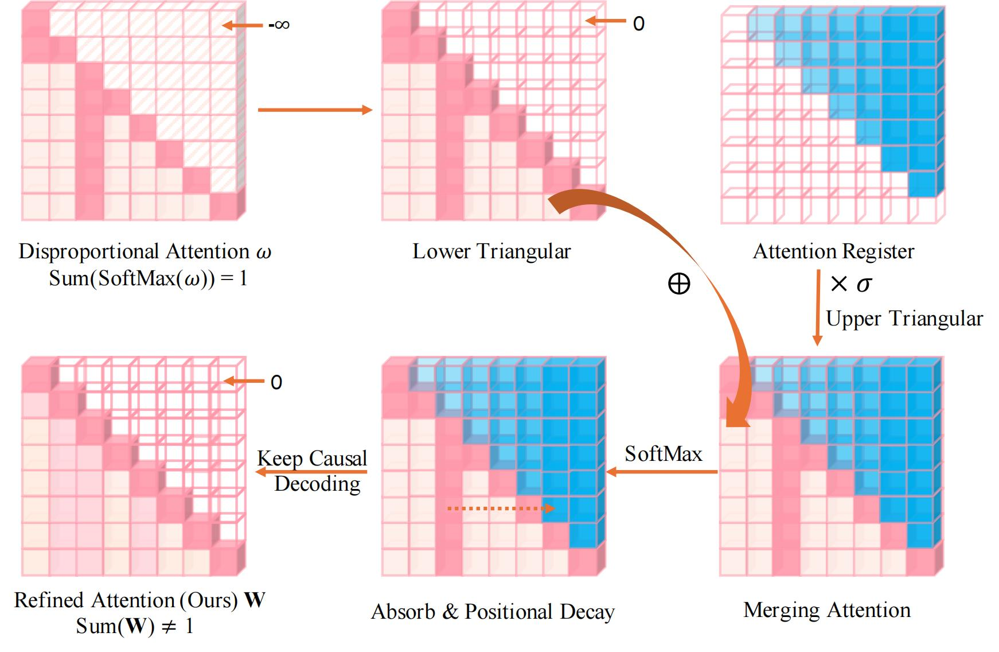

# Seeing Far and Clearly: Mitigating Hallucinations in MLLMs with Attention Causal Decoding (Oral, 3.3% of the accepted papers)
<a href='https://openaccess.thecvf.com/content/CVPR2025/papers/Tang_Seeing_Far_and_Clearly_Mitigating_Hallucinations_in_MLLMs_with_Attention_CVPR_2025_paper.pdf'>
  
</a>
<a href='https://mllms-farsight.github.io/'>
  
</a>

  
## Abstract
Recent advancements in multimodal large language models (MLLMs) have significantly improved performance in visual question answering. However, they often suffer from hallucinations. In this work, hallucinations are categorized into two main types: initial hallucinations and snowball hallucinations. We argue that adequate contextual information can be extracted directly from the token interaction process. Inspired by causal inference in decoding strategy, we propose to leverage causal masks to establish information propagation between multimodal tokens. The hypothesis is that insufficient interaction between those tokens may lead the model to rely on outlier tokens, overlooking dense and rich contextual cues. Therefore, we propose to intervene in the propagation process by tackling outlier tokens to enhance in-context inference. With this goal, we present FarSight, a versatile plug-and-play decoding strategy to reduce attention interference from outlier tokens merely by optimizing the causal mask. The heart of our method is effective token propagation. We design an attention register structure within the upper triangular matrix of the causal mask, dynamically allocating attention capture attention diverted to outlier tokens.
Moreover, a positional awareness encoding method with a diminishing masking rate is proposed, allowing the model to attend to further preceding tokens, especially for video sequence tasks. With extensive experiments, FarSight demonstrates significant hallucination-mitigating performance across different MLLMs on both image and video benchmarks, proving its effectiveness.

<div style="text-align: center;">
    
</div>


## Implementation
<div style="text-align: center;">
    
</div>

## Evaluation

- [x] Setup
- [x] Farsight Inference & Evaluation

---

#### Setup

```powershell
conda create -n farsight python=3.10
conda activate farsight
cd LLaVA
pip install -e .
```

---


## Farsight Inference & Evaluation

###  POPE Evaluation

Use the following scripts to reproduce the experimental results on the **POPE** benchmark.

```bash
bash ./visaug/inference/infer_pope.sh
bash ./visaug/inference/eval_pope.sh
```

---

###  CHAIR Evaluation

Use the following script to evaluate the model on the **CHAIR** benchmark.

```bash
bash ./visaug/inference/eval_chair.sh
```

---


## Acknowledgement

## Citation
```
@inproceedings{tang2025seeing,
  title={Seeing Far and Clearly: Mitigating Hallucinations in MLLMs with Attention Causal Decoding},
  author={Tang, Feilong and Liu, Chengzhi and Xu, Zhongxing and Hu, Ming and Huang, Zile and Xue, Haochen and Chen, Ziyang and Peng, Zelin and Yang, Zhiwei and Zhou, Sijin and others},
  booktitle={Proceedings of the Computer Vision and Pattern Recognition Conference},
  pages={26147--26159},
  year={2025}
}
```
